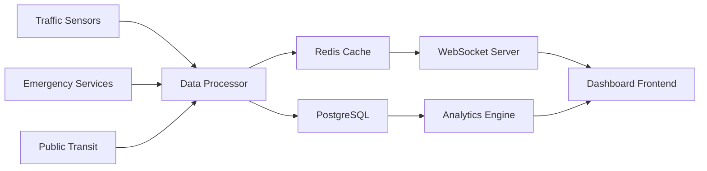

# Urban Planning Analytics Dashboard

A comprehensive real-time analytics platform that revolutionized how Metro City Planning Department makes data-driven decisions about urban development, transportation, and resource allocation.

## The Challenge

Metro City Planning Department faced several critical challenges:

- **Fragmented Data**: Information scattered across 15+ different systems
- **Outdated Tools**: Legacy GIS software from the early 2000s
- **Manual Processes**: Hours spent generating basic reports
- **Limited Insights**: No real-time visibility into city metrics
- **Poor Collaboration**: Departments working in silos

> "We were making million-dollar infrastructure decisions based on months-old data and gut feelings." - Sarah Chen, Chief Urban Planner

## Our Approach

### Discovery & Research Phase

We started with comprehensive stakeholder interviews and system audits:

- **25 stakeholder interviews** across 8 departments
- **Technical audit** of existing GIS infrastructure  
- **User journey mapping** for key planning workflows
- **Data source inventory** and quality assessment

### Key Insights Discovered

1. **Real-time data was critical** for emergency response and traffic management
2. **Cross-departmental collaboration** needed better tools
3. **Mobile access** was essential for field work
4. **Automated reporting** could save 20+ hours per week

## Solution Architecture

### Real-time Data Pipeline

We built a robust data processing pipeline that handles multiple data sources:



### Interactive Mapping Interface

The core of the platform is an advanced mapping interface built with Mapbox GL JS:

- **Multi-layer visualization** of city data
- **Real-time updates** via WebSocket connections
- **Custom clustering** for point data optimization
- **Temporal analysis** with time-series controls

### Automated Reporting System

We implemented an automated reporting system that generates insights:

- **Daily metrics summaries** delivered via email
- **Weekly trend analysis** with actionable recommendations
- **Monthly planning reports** with detailed visualizations
- **Alert system** for anomalies and threshold breaches

## Key Features

### 1. Real-time City Metrics

Live dashboards showing:
- Traffic flow and congestion patterns
- Emergency response times
- Public transit performance
- Air quality measurements
- Energy consumption by district

### 2. Predictive Analytics

Machine learning models that forecast:
- Traffic patterns for event planning
- Infrastructure maintenance needs
- Population growth trends
- Resource demand projections

### 3. Collaborative Planning Tools

Features that enable cross-department collaboration:
- Shared annotation layers
- Comment and review workflows
- Version control for planning documents
- Integration with existing project management tools

### 4. Mobile-First Design

Responsive interface optimized for field work:
- Offline capabilities for remote areas
- GPS integration for location-based data collection
- Touch-optimized map interactions
- Camera integration for issue reporting

## Technical Implementation

### Performance Optimizations

To handle the massive scale of city data, we implemented several optimizations:

**Data Clustering & Aggregation**
```typescript
// Dynamic clustering based on zoom level
const getClusterRadius = (zoom: number): number => {
  return Math.max(20, 100 - (zoom * 10))
}

// Efficient data aggregation for large datasets
const aggregateMetrics = (features: Feature[], groupBy: string) => {
  return features.reduce((acc, feature) => {
    const key = feature.properties[groupBy]
    acc[key] = (acc[key] || 0) + 1
    return acc
  }, {})
}
```

**Progressive Loading Strategy**
- Load critical data first (emergency, traffic)
- Background loading for secondary data
- Intelligent caching based on user patterns
- Predictive prefetching for common workflows

### Security & Compliance

Given the sensitive nature of city data, security was paramount:

- **Role-based access control** with department-level permissions
- **Data encryption** at rest and in transit
- **Audit logging** for all data access and modifications
- **GDPR compliance** for citizen data protection

## Results & Impact

### Quantitative Results

- **75% reduction** in report generation time
- **40% improvement** in emergency response coordination
- **60% increase** in inter-departmental collaboration
- **$2.3M saved** in the first year through optimized resource allocation

### Qualitative Improvements

> "The dashboard has transformed how we approach urban planning. We can now see patterns and correlations that were invisible before." - Michael Rodriguez, Transportation Director

- **Data-driven decision making** became the norm
- **Proactive planning** replaced reactive responses
- **Citizen engagement** improved through transparent data sharing
- **Operational efficiency** increased across all departments

### User Adoption

- **95% user adoption** rate within 3 months
- **4.8/5 user satisfaction** score
- **Zero critical incidents** since launch
- **15+ other cities** requesting similar solutions

## Lessons Learned

### Technical Insights

1. **Real-time requirements** demand careful architecture planning
2. **Data quality** is more important than data quantity
3. **Mobile optimization** cannot be an afterthought
4. **Performance monitoring** is critical for large-scale applications

### Process Learnings

1. **Stakeholder buy-in** must happen at every level
2. **Iterative delivery** builds confidence and enables feedback
3. **Training and support** are crucial for adoption
4. **Change management** requires dedicated resources

## Future Enhancements

The platform continues to evolve with planned enhancements:

### Phase 2 Roadmap
- **AI-powered insights** for anomaly detection
- **Citizen engagement portal** for community input
- **IoT sensor integration** for environmental monitoring  
- **Augmented reality** features for field planning

### Emerging Technologies
- **Digital twin** integration for 3D city modeling
- **Blockchain** for secure inter-agency data sharing
- **Edge computing** for faster emergency response
- **Machine learning** for predictive maintenance

## Technology Stack

### Frontend
- **Next.js 14** for the web application
- **Mapbox GL JS** for interactive mapping
- **D3.js** for custom data visualizations
- **Framer Motion** for smooth animations

### Backend  
- **Node.js** with Express for API services
- **PostgreSQL** with PostGIS for spatial data
- **Redis** for caching and session management
- **WebSocket.io** for real-time updates

### Infrastructure
- **AWS** for cloud hosting
- **Docker** for containerization
- **Kubernetes** for orchestration
- **Terraform** for infrastructure as code

### Monitoring & Analytics
- **Datadog** for application monitoring
- **Mixpanel** for user analytics
- **Sentry** for error tracking
- **Grafana** for system metrics

---

## Ready to Transform Your Planning Process?

Metro City's success story demonstrates the power of modern geospatial technology in urban planning. If you're ready to revolutionize how your organization makes location-based decisions, [let's discuss your project](/contact).

### Related Solutions
- [Mapping Infrastructure for Scalable GIS Applications](/domains/mapping-infrastructure)
- [Smart Terrain for Advanced Geospatial Analysis](/domains/smart-terrain)
- [AI-Powered Insights and Analytics](/domains/artificial-intelligence) 